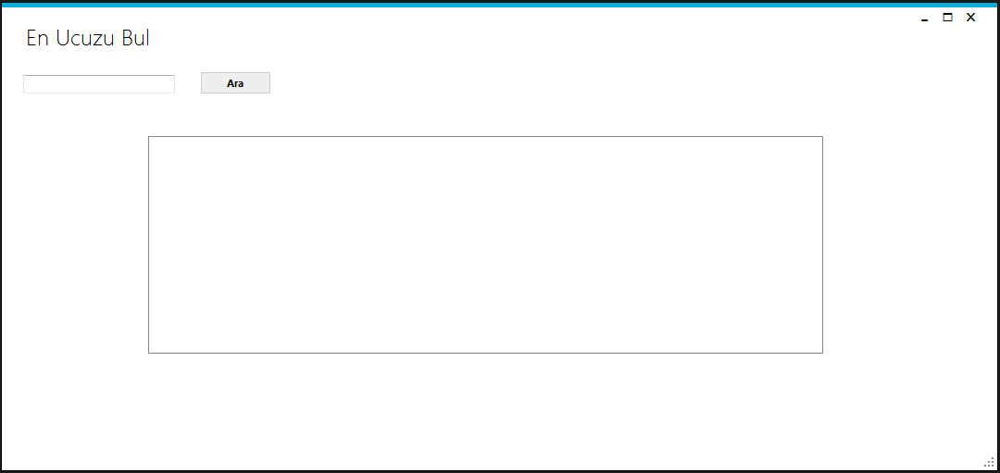
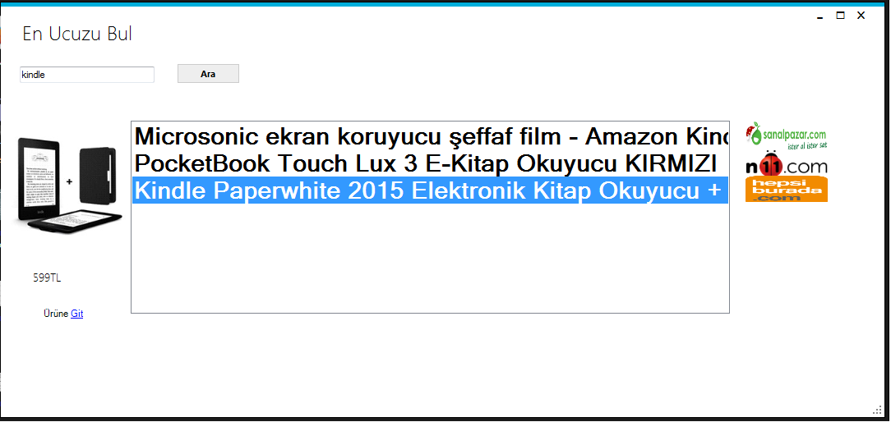

**Proje adý** 			 :     En ucuzu bul
  
**Proje Geliþtiricileri** : Ahmet Ýlgin   : 279967  |
                                 Aykut Arýcýoðlu : 279998 |
  							     Aykut Durucan  : 279988 |
  							     Ýlker Yasin Aksoy  : 279975
  
  **Proje konusu:**
  
  Projemiz satýn alýnacak ürünlerin ucuzunu bulmak ve müþterinin site site gezmesine çözüm olmasý için tasarlanmýþtýr. Projede, en popüler alýþveriþ 
siteleri olduðundan; Hepsiburada, Sanalpazar, N11 sitelerinin kullanýlmasý kararlaþtýrýldý. Bahsedilen web siteleri incelendi;
kütüphanelerinin html parse yeteneði ve grafiksel arayüz yeteneði göz önüne alýnarak C# dili tercih edildi. Projeye uygunluðu sebebi ile nesne 
yönelimli programlama mimarisi kullanýldý. Daha iyi bir arayüz görünümü için metro framework kullanýldý. Form tepkisizliði sorununa  karþýn thread 
kullanma kararý alýndý. HtmlAgilityPack, Fizzler, AngleSharp hazýr .NET kütüphaneleri incelenerek, HtmlAgilityPack kütüphanesinin kullanýlmasý kararlaþtýrýldý.

Program çalýþtýrýldýðýnda bizi hoþ bir ekran karþýlýyor. Kullanýcý dostu bir tasarým olup, kullanýcýnýn sadece arama yapacaðý kelime girmesi yeterli oluyor. 
Ara buttonuna týklandýðýnda belirtilen siteler üzerinde asenkron olarak arama yapýlýp liste biçiminde, ürünler fiyata göre sýralý (bubble sort algoritmasý) gelerek karþýmýza çýkarýyor.
Listeden eleman seçtiðimizde ürün resmi ve fiyatý sol tarafta karþýmýza çýkýyor. Ürüne git dediðimizde ürünün bulunduðu linke gidiyor. 

Projemizi bitbucket ortamýnda git versiyon kontrol sistemini kullanarak gerçekleþtirdik. Takým çalýþmasýnýn nasýl olmasý gerektiði bir proje üzerinde nasýl toplu
çalýþýlacaðý hakkýnda fikir sahibi olduk. 

